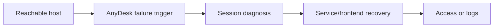

# AnyDesk Connect Skill

Portable recovery skill for Linux AnyDesk sessions that are online but fail to attach to the active desktop.

## Who This Is For

| Use this when you... | Use something else when you... |
| --- | --- |
| SSH or Tailscale can reach the Linux host | need to install AnyDesk from scratch |
| AnyDesk appears online but times out or ends unexpectedly | cannot reach the host over the network at all |
| the likely issue is frontend attachment to an active X11 session | want a Wayland-only workflow without X11 fallback |

## Why This Exists

- Keeps remote recovery narrow and diagnosis-first.
- Separates desktop-session attachment from generic network debugging.
- Makes high-impact actions explicit before escalation.

## What Ships

| Component | Role |
| --- | --- |
| [`anydesk-connect`](./anydesk-connect) | installable Codex App skill package |
| [`anydesk-connect/agents/openai.yaml`](./anydesk-connect/agents/openai.yaml) | Codex App interface metadata |
| [`anydesk-connect/scripts`](./anydesk-connect/scripts) | bundled helper scripts |
| [`anydesk-connect/test-prompts.json`](./anydesk-connect/test-prompts.json) | trigger and non-trigger examples |
| [`CHANGELOG.md`](./CHANGELOG.md) | release history |
| [`LICENSE`](./LICENSE) | license |

## Install / Use

### Codex App

- Install the skill from this repo path: `anydesk-connect`
- GitHub install target:
  - repo: `Mingdao007/anydesk-connect-skill`
  - path: `anydesk-connect`
- Restart `Codex App` after installation so the new skill is discovered.

## Workflow

## Coverage

- X11-versus-Wayland diagnosis before deeper recovery steps
- service restart plus frontend reattachment workflow over SSH
- log collection for escalation when recovery does not restore access

## Expected Result / Verification

| Check | Expected result |
| --- | --- |
| Install target | `anydesk-connect` |
| GitHub target | `Mingdao007/anydesk-connect-skill` with path `anydesk-connect` |
| Skill entrypoint | `anydesk-connect/SKILL.md` exists |
| Trigger examples | `anydesk-connect/test-prompts.json` |
| Privacy check | public package contains no private local paths or live user state |

## Trigger Examples

- `Recover this Linux AnyDesk host over SSH.`
- `The host is online but the AnyDesk client times out.`
- `Diagnose desk_rt_ipc_error on a remote desktop.`

## Non-Trigger Examples

- `Set up AnyDesk from scratch on a new machine.`
- `Debug a VPN that cannot reach the host at all.`
- `Fix a Wayland-only desktop workflow without switching to Xorg.`

## Privacy Boundary

This public repository keeps the workflow generic and reusable.

- The public package contains no machine-specific IPs, user names, or hostnames.
- Recovery commands use environment-derived paths instead of private absolute paths.

## Repository Layout

| Path | Purpose |
| --- | --- |
| [`anydesk-connect`](./anydesk-connect) | installable Codex App skill package |
| [`anydesk-connect/agents/openai.yaml`](./anydesk-connect/agents/openai.yaml) | Codex App interface metadata |
| [`anydesk-connect/scripts`](./anydesk-connect/scripts) | bundled helper scripts |
| [`anydesk-connect/test-prompts.json`](./anydesk-connect/test-prompts.json) | trigger and non-trigger examples |
| [`CHANGELOG.md`](./CHANGELOG.md) | release history |
| [`LICENSE`](./LICENSE) | license |

Chinese:

- [README.zh-CN.md](./README.zh-CN.md)
